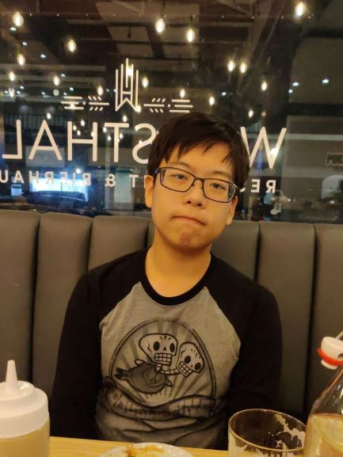

Hey! I'm Junhyun Lim. 

I also go by names like ensj, and Jimmy. I'm currently studying for an undergraduate degree in Math and Computer Science in Santa Clara University!

A little less well-known, but I've also worked as a Korean-English translator since 2015! I've worked on / been involved in the following projects in below websites:
- [Wuxiaworld](https://www.wuxiaworld.com/)
  - [Life, Once Again!](https://www.wuxiaworld.com/novel/life-once-again)
- [Ensj Translations](https://ensjtrans.com/)
  - [I'm Sorry For Being Born In This World!](https://www.amazon.com/Sorry-Being-Born-This-World-ebook/dp/B07HFTYNDD/ref=sr_1_1?dchild=1&keywords=Im+sorry+for+being+born&qid=1599399817&sr=8-1)

This website is primarily for me to write about the various things I've done & developed an interest in. You can expect scribbles about Number Theory, Linear Algebra, and Graph Theory! Perhaps some scritches about the spaghetti code I've written in the past as well. Who knows?